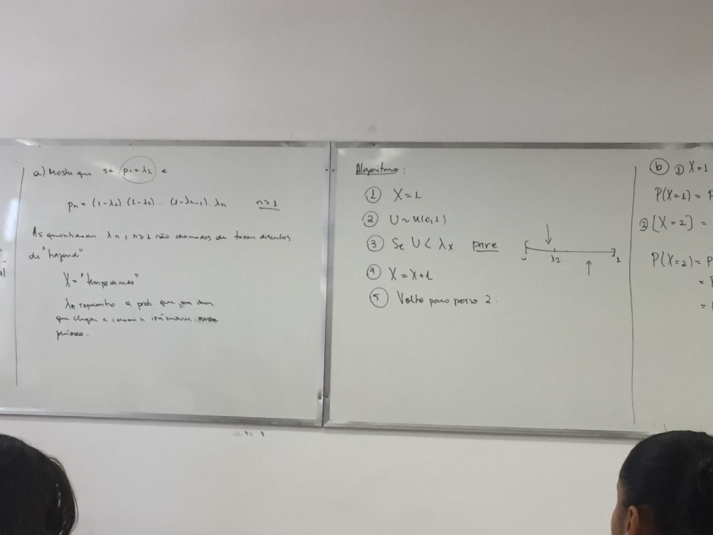
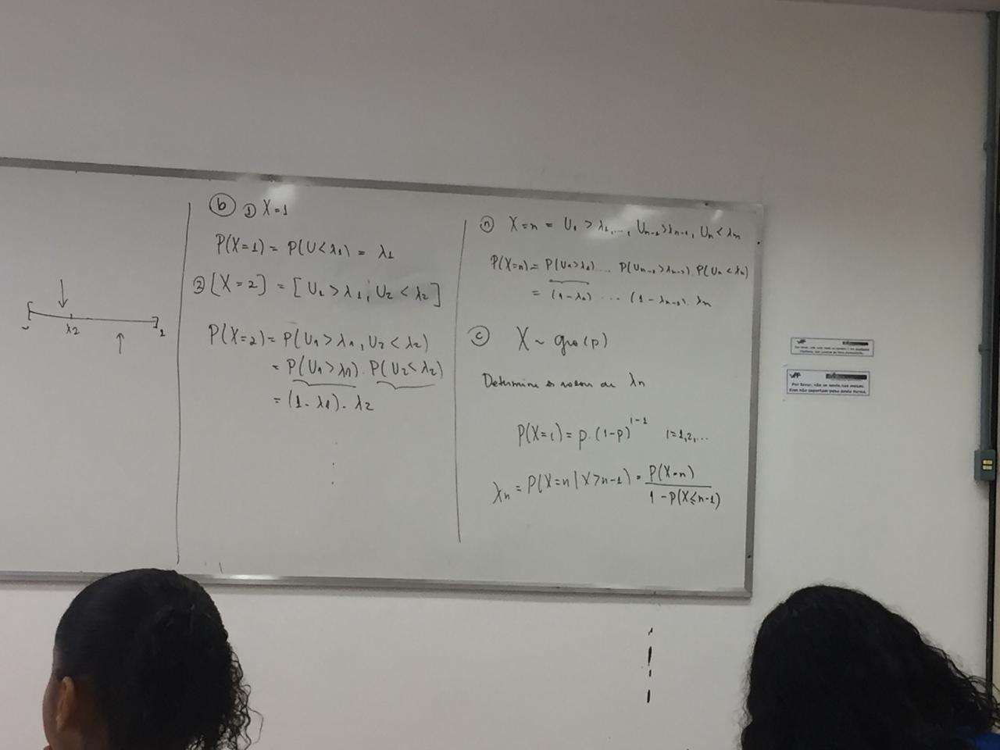

```{r setup, include=FALSE}
knitr::opts_chunk$set(echo = TRUE)
```

## Exercicio 1

Gerando os $X$'s


```{r}
f <- function( ){
  u <- runif(1)
  if (u<1/3){
    x <- 1
  }
  else {x <- 2}
  return(x)
}
```

Achando a quantidade de 1's

```{r}
N <- function(n){
  x <- 0; cont <- 0
  for (i in 1:n){
    x[i] <- f( )
    if (x[i]==1){
      cont <- cont+1
    }
  }
  cont <- cont/n
  return(cont)
}
```

#Item A
```{r}
N(100)
```

#Item B
```{r}
N(1000)
```

#Item C
```{r}
N(10000)
```

##Exercicio 2

Primeira ideia  
Nessa primeira ideia gerando um valor de $X$ cada vez

```{r}

X <- function(p,x){
  u <- runif(1); s <- 0
  for (i in 1:length(p)){
    s <- s+p[i]
    if (u<s){
      return(x[i])
    }
  }
}

#Testando
e <- 0
for (i in 1:10000){
  e[i] <- X(c(1/3,2/3),c(1,2))
}
mean(e)
```

Na segunda ideia geramos uma quantidade $n$ de valores de $X$ e tiramos a média.

```{r}
X2 <- function(p,x,n){
  a <- 0
  for (j in 1:n){
    u <- runif(1); s <- 0
    for (i in 1:length(p)){
      s <- s+p[i]
      if (u<s){
        a[j] <- x[i]
        break
      }
    }
  }
  mean(a)
}
X2(c(1/3,2/3),c(1,2),100000)
```

## Exercicio 3

Pelo Método da Função Inversa
```{r}
p <- c(.3,.2,.35,.15)
f <- function(){
  u <- runif(1)
  if(u < 0.3) return(1)
  if(u < 0.5) return(2)
  if(u < 0.85) return(3)
  return(4)
}
```

Pelo método da rejeição
```{r}
g <- function(){
  prob <- c(.3, .2, .35, .15)
  y <- as.integer(4*runif(1)) + 1
  while(runif(1) > prob[y]/.35){
    prob <- c(.3, .2, .35, .15)
    y <- as.integer(4*runif(1)) + 1
  }
  return(y)
}
```

```{r}
# testando o algoritmo
# Método da transformação inversa
e <- 0 
for (i in 1:100000){
  e[i] <- f( )
}
mean(e)

# Método da rejeição.
h <- 0 
for (i in 1:100000){
  h[i] <- g()
}
mean(h)

```

<details>
<summary>
Usando as funções do execicio anterior
</summary>
```{r}
X <- function(p,x){
  u <- runif(1); s <- p[1]
  for (i in 1:length(p)){
    if (u<s){
      return(x[i])
    }
    s <- s+p[i]
  }
}
#Testando
e <- 0
for (i in 1:10000){
  e[i] <- X(c(.3,.2,.35,.15),c(1:4))
}
mean(e)

```

```{r}
X2 <- function(p,x,n){
  a <- 0
  for (j in 1:n){
    u <- runif(1); s <- 0
    for (i in 1:length(p)){
      s <- s+p[i]
      if (u<s){
        a[j] <- x[i]
        break
      }
    }
  }
  mean(a)
}
X2(c(.3,.2,.35,.15),c(1:4),100000)
```
</details>

##Exercico 4

Sabemos que a probabiliade da i-esima carta sair na i-esima posição é 1/100.  
Definindo $I_{i}=$"i-esima carta sair no posição i-esima".  
Temos que a esperança que queremos estimar é: $\mathbb{E}[X]=1$, onde $X=I_{1}+I_{2}+...+I_{100}$.  
Vamos estimar $\mathbb{E}[I_{1}+I_{2}+...+I_{100}]$, onde sabemos que $I_{i}\sim Ber(1/100)$.  

Gerando $I_{i}\sim Ber(1/100)$
```{r}

ber <- function(p){
  # p é a probabilidade de sucesso
  u <- runif(1)
  if (u<1-p){
    y <- 0
    return(y)
  }
  else {
    y <- 1
    return(y)
  }
}

#Achando I1+I2+...+I100
a <- 0;  x <- 0
for (j in 1:1000){
  for (i in 1:100){
    a[i] <- ber(1/100)
  }
  x[j] <- sum(a)
}
mean(x)
```

##Exercicio 7

Vamos primeiro gerar $X$ com função de probabidade dada por: $P_{x}=c(1,2,3,4,5,6,5,4,3,2,1)/36$, e em seguida vamos estimar o q se pede no enunciado.   

Vamos usar o método da rejeição e $c=\frac{66}{36}$ $\rightarrow$ $h=6P_{x}$.

```{r}
p <- c(1,2,3,4,5,6,5,4,3,2,1)/36; n <- c(2:12)

f <- function(p){
  n <- c(2:12); x <- 0
  while(sum(n)>0){
    u1 <- runif(1); u2 <- runif(1)
    y <- as.integer(11*u1)+1
    h <- 6*p[y]
    while (u2>=h){
      u1 <- runif(1)
      y <- as.integer(11*u1)+1
      h <- 6*p[y]
      u2 <- runif(1)
    }
    n <- setdiff(n,y+1)
    x <- x+1
  }
  return(x)
}
f(p)

#Testando 

x <- 0
for (i in 1:1000){
  x[i] <- f(p)
}
mean(x)

```

##Exercico 10

###Item A

Sabemos que uma binomial negativa é a soma de Geometricas com parâmetro p.  
```{r}
geometrica <- function(p){
  u1 <- runif(1)
  x <- 1+as.integer(log(1-u1)/log(1-p))
  return(x)
}

bio_neg <- function(p,r){
  y <- 0
  for (i in 1:r){
    y[i] <- geometrica(p)
  }
  return(sum(y))
}
bio_neg(0.1,4)

#Verificando se esta correto
a <- 0
for (i in 1:10000){
  a[i] <- bio_neg(0.1,4)
}
mean(a)
```

###Item C
<span style="color:red">TOMAR CUIDADO COM A RECURSÃO E COM O VALOR DE P NA RECUSÃO.</span>.

```{r}
bio_neg2 <- function(p,r){
  u1 <- runif(1)
  i <- r; p_inicial <- p
  p <- p**r; f <- p
  while (u1>=f){
    i <- i+1; p <- (i-1)*(1-p_inicial)*p/(i-r); f <- p+f
  }
  x <- i
  return(x)
}
bio_neg2(0.1,4)

#Verificando se esta correto
a <- 0
for (i in 1:10000){
  a[i] <- bio_neg2(0.1,4)
}
mean(a)
```


##Exercicio 11

Vamos gerar um exponencial 1º
```{r}
expo <- function(lambda){
  u <- runif(1)
  y <- -log(1-u)/lambda
  return(y)
}
```

Vamos gerar normal padrão e dps com transformações teremos uma normal qualquer
Vamos usar o metodo da rejeicao com $c=\displaystyle\frac{e^{2e^{1/2}}}{\sqrt(2\pi)}$ e $h=\displaystyle\frac{e^{-(y-1)^2}}{2}$.  
Gerando normais
```{r}

normal <- function(mu,sigma2){
  y <- expo(1); y
  u1 <- runif(1)
  while (u1>=exp(-(y-1)**2/2)){
    y <- expo(1)
    u1 <- runif(1)
  }
  u2 <- runif(1)
  if (u2<=.5){
    x <- (-1)*y
  }
  else {
    x <- y
  }
  #Gerando uma normal sem ser padrão
  x <- sigma2*x + mu
  return(x)
}

```

Gerando $|Z|$ onde $Z\sim$ N(0,1)
```{r}
Z <- function ( ){
  z <- abs(normal(0,1))
  return(z)
}
```

Calculando $\mathbb{E}[|Z|]$
```{r}
e <- 0
for (i in 1:100000){
  e[i] <- Z( )
}
mean(e)
```

##Exercico 13

###ITEM A

Note que $\mathbb{P}(Y=i)=\frac{\mathbb{P}(X=i)}{a}$ para $n\geqslant i\geqslant k$, veja tambem $\mathbb{P}(Y=i+1)=\frac{(n-i)p}{(i+1)(1-p)}\mathbb{P}(Y=i)$

```{r}
f <- function(n,p,k,a){
  u <- runif(1)
  u1 <- runif(1)
  i <- k; p_inicial <- p
  p <- (choose(n,k)*(p**k)*(1-p)**(n-k))/a; f <- p
  while (u>=f){
    p <- (n-i)*p_inicial*p/((i+1)*(1-p_inicial)); i <- i+1; f <- f+p
  }
  x <- i
  return(x)
}

#Testando 

e <- 0
for (i in 1:1000){
 e[i] <- f(3,.5,1,.5) 
}
mean(e)
```

###ITEM B
**NÃO SEI PQ EST DANDO DIFERENTE DO ITEM A**  
Vamos usar o Método da Rejeição comparando com uma binomial
Temos que $c=\displaystyle\frac{1}{a}$ ==> $h=\displaystyle\frac{ap_{z}}{q_{z}}$???????

Gerando um binomial

```{r}
ber <- function(p){
  # p é a probabilidade de sucesso
  u <- runif(1)
  if (u<1-p){
    x <- 0
    return(x)
  }
  else {
    x <- 1
    return(x)
  }
}
binomial <- function(n,p){
  y <- 0
  for (i in 1:n){
    y[i] <- ber(p)
  }
  x <- sum(y)
  return(x)
}
```

Gerando a $X$

```{r}
py <- function(i,n,p,a,k){
  if (i>=k & n>i){
    p <- dbinom(i,n,p)/a
    return(p)
  }
  else{
    p <- 0
    return(p)
  }
} 

f2 <- function(n,p,k,a){
  y <- binomial(n,p)
  qy <- dbinom(y,n,p) 
  py <- py(y,n,p,a,k)
  u <- runif(1)
  h <- a*py/qy
  while(u>h){
    y <- binomial(n,p)
    qy <- dbinom(y,n,p) 
    py <- py(y,n,p,a,k)
    u <- runif(1)
    h <- a*py/qy
  }
  x <- y
  return(x)
}

#Testando

e1 <- 0
for (i in 1:1000){
  e1[i] <- f2(3,.5,1,.5) 
}
mean(e1)
```

##Exercico 14

Estou usando a função do exercicio 2.
Sabemos que a esperança verdadeira é 9.45

```{r}
X <- function(p,x){
  u <- runif(1); s <- 0
  for (i in 1:length(p)){
    s <- s+p[i]
    if (u<s){
      return(x[i])
    }
  }
}

#Testando
x <- c(5:14)
p <- rep(c(0.11,.09),times=5)
e <- 0
for (i in 1:10000){
  e[i] <- X(p,x)
}
mean(e)
```

##Exercicio 15

Usando a função do exercicio 2 desse capitulo
Sabemos que a esperança verdadeira é 6.48. Não foi usado o método da composição
```{r}
X <- function(p,x){
  u <- runif(1); s <- 0
  for (i in 1:length(p)){
    s <- s+p[i]
    if (u<s){
      return(x[i])
    }
    
  }
}
x <- c(1:10)
p <- c(rep(.06,time=5),.15,.13,.14,.15,.13)

#Testando

e <- 0
for (i in 1:10000){
  e[i] <- X(p,x)
}
mean(e)
```

##Exercico 16

Vamos usar o Método da Composição

Primeiro note que;  
$\mathbb{P}(X=i)=.5\mathbb{P}_{1}(X_{}=i)+.5\mathbb{P}_{2}(X_{2}=i)$, onde $X_{1}\sim Geo(.5)$ e $X_{2}\sim Geo(1/3)$

Gerando Geometricas

```{r}
geometrica <- function(p){
  u1 <- runif(1)
  x <- 1+as.integer(log(1-u1)/log(1-p))
  return(x)
}
```

Se $t=1$ geramos $X_{1}$ e se $t=2$ geramos $X_{2}$.  
Sabemos que a esperacnça é 2.5 (http://www.wolframalpha.com/input/?i=%5Csum+_%7Bn%3D0%7D%5E%7B%5Cinfty+%7D%5C:n%5Cleft(%5Cfrac%7B1%7D%7B2%7D%5E%7Bn%2B1%7D%2B%5Cfrac%7B2%5E%7Bn-1%7D%7D%7B2%5Ccdot+3%5En%7D%5Cright))
```{r}

funcao=function(){
  u <- runif(1)
  t <- as.integer(2*u)+1

  if (t==1){
    x <- geometrica(.5)
    return(x)
  }
  if (t==2){
    x <- geometrica(1/3)
    return(x)
  }
}

#Testando

x <- 0
for (i in 1:100000){
  x[i] <- funcao()
}
mean(x)
```

##Exercicio 17


##Exercicio 18

